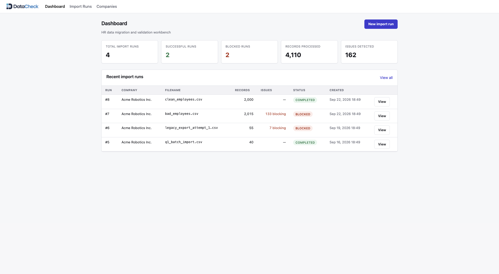
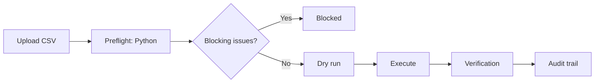
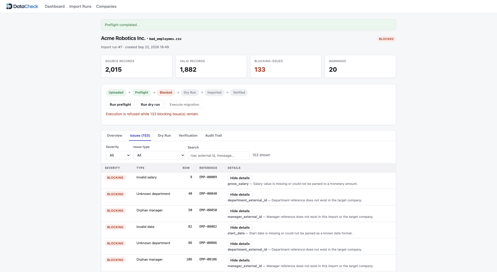
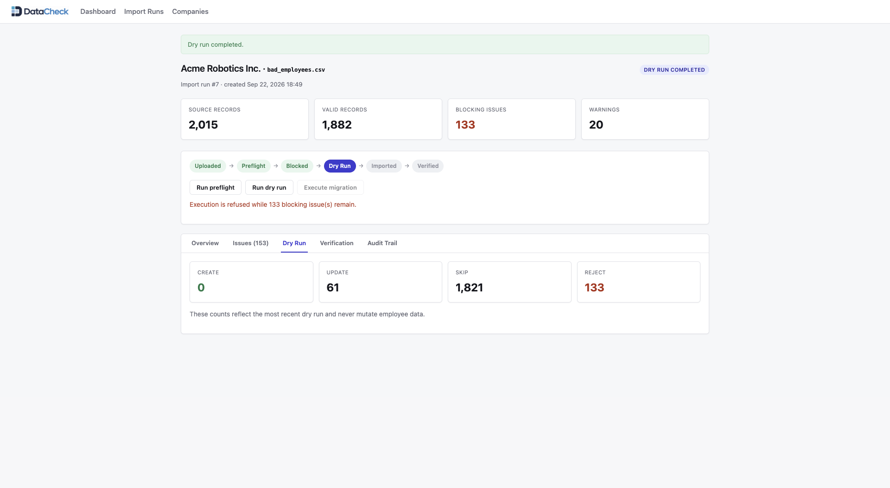
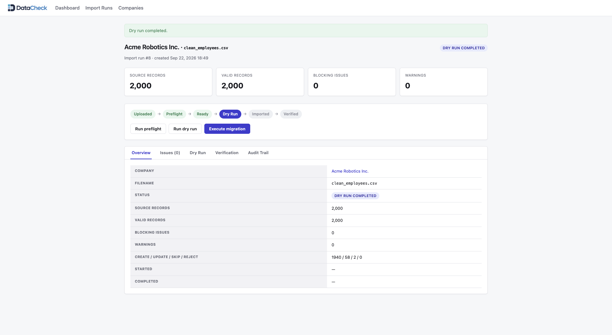
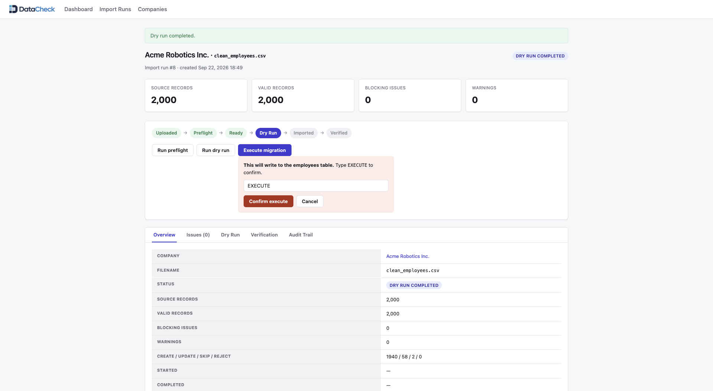
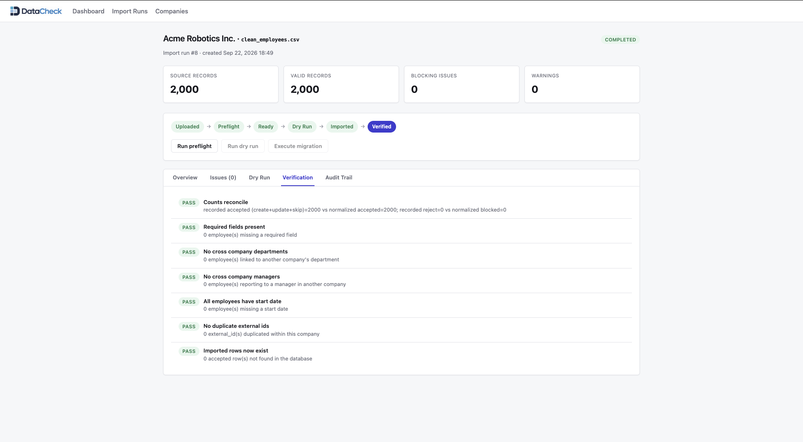
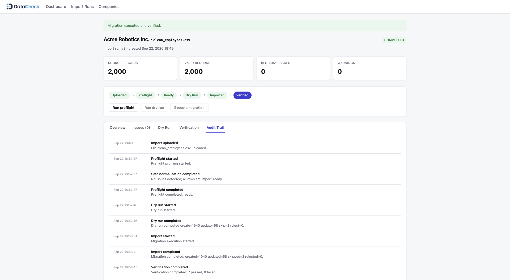

# DataCheck

DataCheck is a small internal style tool for migrating employee records from a legacy HR export into a database. Every import goes through checking, previewing, running, and verifying, instead of just loading a CSV and hoping for the best.


<p align="center"><em>Overview of import activity, processing volume, blocked runs and completed migrations.</em></p>

## Why I built this

I wanted to build something around the kind of problems that show up in data operations and technical support work: debugging, working with databases, tracking down why data doesn't add up, and thinking about how information moves safely between systems. I'm more interested in what happens underneath an application than in building another user facing screen, and importing a CSV sounded like a good excuse to explore that.

It sounds trivial until you ask what happens when some rows are valid and others aren't, which problems can be fixed automatically versus which should stop the process, and whether running the same import twice by accident is actually safe. DataCheck is a small, simplified environment I built to explore those questions myself, not a claim that I invented these patterns or a stand in for a real company's system. It uses synthetic HR data because that kind of relational data creates exactly the duplicate identifiers and broken references I wanted to practice with.

## How a migration works



A CSV upload creates an ImportRun. Preflight hands the file to a small Python script that checks every row against the company's existing departments and employees, normalizing anything with a safe fix, like a date written as 03/14/2019 instead of 2019-03-14, and flagging anything unresolvable, like a duplicate external ID or a manager that doesn't exist, as a blocking issue that stops the run from executing.

From there, a dry run previews the result, execution applies it inside a transaction if nothing is blocking, and verification and the audit trail close the loop. Each of those gets its own section below.

## A bad import, for real

The repository ships a synthetic dataset from a fixed random seed, so the same commands always produce the same numbers. Preflight on the intentionally broken sample (`bad_employees.csv`) reports 2,015 source rows, 1,882 valid, 133 blocking issues, and 20 warnings: duplicate external identifiers, unknown departments, orphan managers, invalid dates, missing identifiers, invalid salaries, and invalid emails.


<p align="center"><em>Preflight detects blocking and warning-level data quality issues before any database mutation.</em></p>

The distinction I cared about most is between a safe transformation and an ambiguous one. A salary written in a supported and unambiguous format can be normalized automatically. A missing manager or a duplicated employee ID doesn't, so the import stops instead of guessing. A malformed email is only a warning, dropped rather than guessed at, and never blocks the row.

A run with blocking issues isn't a dead end, though: it can still be dry run to preview what execution would do, so the impact is visible even while execution itself stays refused until the issues are resolved.


<p align="center"><em>Invalid imports can still be analyzed through a dry run while execution remains safely blocked.</em></p>

## Dry run and execution share the same logic

A dry run walks through the exact same decision for every row, create, update, skip, or reject, that execution uses, without touching the database. Against the demo's clean dataset it reports 1,940 creates, 58 updates, 2 skips, and 0 rejects, and none of those rows actually change.

That's not a coincidence: both call the same `MigrationPlan` class, one with `persist: false` and one with `persist: true`, so the preview can't quietly disagree with the real operation.


<p align="center"><em>Dry runs preview create, update, skip and reject decisions before any data is written.</em></p>

## Idempotency

Running the same import twice shouldn't create duplicate employees. Running the identical clean file again reports 0 creates, 0 updates, 2,000 skips, 0 rejects, which matters because migrations get retried and files get re-uploaded by accident.

Application logic makes the import idempotent by detecting existing and unchanged records, while PostgreSQL provides a final integrity backstop with a unique index on company and external ID.

## The database is the last line of defense

PostgreSQL does more than store rows here. Foreign keys tie employees to companies, departments, and managers, a composite unique index on company and external ID prevents duplicate employees, a check constraint keeps salaries non-negative, and a manager can reference another employee in the same company through a self referencing foreign key.

Rails validations catch most problems first, but the database is the final guarantee, proven by a test that bypasses validation entirely and confirms Postgres refuses a duplicate anyway.

## Verification and the audit trail

Execution is the one step that mutates the database, so the interface requires typing EXECUTE to confirm before it runs, a deliberate speed bump against triggering a real migration by accident.


<p align="center"><em>Execution requires an explicit confirmation before database changes are applied.</em></p>

Finishing without an exception isn't the same as finishing correctly, so after execution DataCheck runs a separate verification pass that queries the database from scratch. It runs seven checks, none hardcoded to pass: whether reported counts reconcile with the normalized file, required fields are present, there are no duplicate company scoped external IDs, no employee points at a department or manager in a different company, every employee has a start date, and every accepted row actually exists afterward.


<p align="center"><em>Post-migration verification runs seven independent checks against PostgreSQL to confirm data integrity and reconciliation.</em></p>

Every stage of a run, from upload through verification, is also written to an audit trail, so someone looking at it later can reconstruct what happened without digging through raw logs.


<p align="center"><em>The audit trail records the complete migration lifecycle from upload through verification.</em></p>

## Treating synthetic data as if it were real

All the HR data here is fake, generated locally from a fixed seed, but I treated it as if it were real. An issue that preflight records includes the row number, external ID, field, and a plain description of the problem, leaving out the actual name, email, or salary value, so the issue log doesn't become a second, less protected copy of sensitive data.

## A debugging case study

I also wanted something closer to the investigative side of support engineering. `docs/incident-case-study.md` walks through a synthetic incident: a payroll export where recently re-contracted employees started showing up twice, caused by a join against a one to many contract history table that returned one row per contract instead of one per employee. It covers the symptom, the reproduction, the SQL reasoning, the fix (selecting the current contract instead of the full history), and the regression test in `spec/services/payroll/export_query_spec.rb`.

## Architecture

DataCheck is a Rails application backed by PostgreSQL, with a small Python script doing the CSV profiling and normalization as a subprocess rather than a separate service. Rails calls it, reads back the JSON it returns, and owns everything from there: issue records, run status, every database write.

TypeScript, built with esbuild and Stimulus controllers, handles small interface interactions: filtering issues, expandable details, tabs, and a confirmation step requiring EXECUTE before a migration runs. A REST API covers the same operations, and a small, intentionally read only GraphQL endpoint exposes import runs and their issues.

There's also a small standalone Java command line tool in `tools/legacy-export-converter` that converts an older semicolon delimited export into the CSV format DataCheck expects. I kept it completely outside the critical application path because the main workflow does not need Java to function. It represents the kind of small legacy utility that a data or support engineer may need to inspect, maintain, or adapt when information has to move between older and newer systems. Keeping Rails as the main application and Python as a focused subprocess was also intentional. The project is small enough that splitting those responsibilities into separate services would add complexity without solving a real problem.

## Tech stack

| Layer | Technology |
|---|---|
| Application | Ruby on Rails |
| Database | PostgreSQL |
| Data profiling | Python, standard library only |
| Frontend interactivity | TypeScript, Stimulus, esbuild |
| API | REST and a small read only GraphQL endpoint |
| Testing | RSpec, Python's unittest |
| CI | GitHub Actions |
| Optional utility | Java (legacy format converter) |

## Engineering decisions I wanted to explore

Sharing one `MigrationPlan` between dry run and execution removes a whole category of bugs where the preview and the real operation quietly disagree. I also chose to block ambiguous data instead of trying to make the importer guess. Automatically normalizing a known format is useful, but inventing a manager reference or deciding which duplicated identifier is correct would be much more dangerous than stopping the process. Idempotency solves another practical problem by making retries safe and preventing the same dataset from creating duplicate or unnecessary changes. Verification addresses something different. A migration can finish without raising an exception and still leave the database in the wrong state, so DataCheck checks the result again after execution. Keeping the architecture simple was part of the exercise too. A Rails monolith with a focused Python subprocess was enough for the problems I wanted to explore, without adding services or infrastructure that the project did not actually need.

## What I learned

This project made it clearer to me that data operations work is less about clever algorithms and more about carefully controlling state: knowing what changed, being able to explain why, and making failures understandable instead of mysterious.

I also enjoyed the parts closest to debugging, tracing a problem through a join, a constraint, or a subprocess boundary, more than expected, which is part of why I wanted to build something in this space.

## Testing

The Rails app is tested with RSpec: preflight detection, dry run behavior, execution, idempotency, transaction rollback, database constraints, verification, and the REST and GraphQL surfaces. The Python profiler has its own unittest suite, TypeScript is type checked and built with esbuild, and the Java tool has its own small dependency free runner. GitHub Actions runs all of it on every push.

```bash
bundle exec rspec
cd scripts && python3 -m unittest discover -s tests
npm run typecheck && npm run build
tools/legacy-export-converter/test/run.sh
```

## Running it locally

Requires Ruby, Node, Python 3, and a local PostgreSQL instance.

```bash
git clone https://github.com/NahuelRibera/DataCheck.git
cd DataCheck
bin/setup
bin/rails server
Open http://localhost:3000
```

`bin/setup` installs dependencies, builds the TypeScript bundle, prepares the database, and seeds a demo company with deterministic data. The app runs at the usual local Rails address afterward. `bin/rails demo:seed` resets the demo data at any point and is safe to run again.

## A quick demo

1. Open the `bad_employees.csv` import run and run preflight. It should detect 133 blocking issues and 20 warnings without writing any employee records.
2. Try to execute that run anyway. It's refused, both in the interface and through the API.
3. Open the `clean_employees.csv` run. Run preflight (no blocking issues), run a dry run (nothing written), then execute it and watch verification run automatically afterward.
4. Run the same clean file again. The dry run should report 2,000 skips and nothing else, since everything already matches.

## More detail

`docs/architecture.md` covers the components and the tradeoffs behind them. `docs/incident-case-study.md` has the full debugging write up described above.
