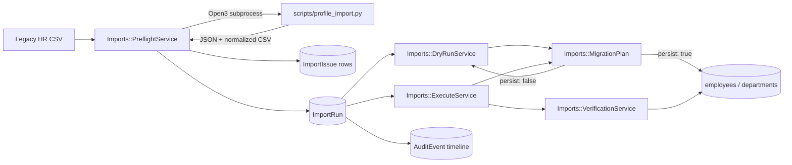

# Architecture

DataCheck is a Rails monolith. There is no separate frontend app, no
microservices, and no job queue -- the migration pipeline runs synchronously,
request-response, because at the scale this tool operates at (thousands of
rows, not millions) that's simpler to build, test, and reason about than a
background-job pipeline, and it keeps the audit trail trivially consistent
with what the user just saw happen.

## Components

- **Python (`scripts/profile_import.py`)** does the actual data-quality
  analysis: schema checks, duplicate detection, date/salary normalization,
  department/manager resolution. It's a standalone script with no Rails
  dependency, invoked over `Open3.capture3` with an argv array (never an
  interpolated shell string) and no network access. It's a subprocess, not a
  service, so there's nothing to deploy or keep alive.
- **Rails** owns the domain model, the workflow/state machine on `ImportRun`,
  and every write to the `employees` table. It never trusts the Python
  process's exit code alone -- a non-zero exit or malformed JSON marks the
  run `failed` with an audit event rather than raising into a 500.
- **`Imports::MigrationPlan`** is the one place that decides create vs.
  update vs. skip vs. reject. Both `DryRunService` (`persist: false`) and
  `ExecuteService` (`persist: true`) call it, so the numbers a user sees in
  a dry run are guaranteed to match what execution actually does -- they
  are, literally, the same code path.
- **PostgreSQL** is the system of record and the last line of defense:
  `(company_id, external_id)` uniqueness on `employees` is enforced at the
  database level, not just in application validations, so even a bug in the
  Ruby layer can't create duplicate employees.
- **TypeScript** (`app/javascript/src`, bundled with esbuild to
  `public/builds/application.js`) runs entirely client-side: tab switching,
  issue filtering, and the "type EXECUTE to confirm" migration guard. None
  of it talks to a server directly -- all mutating actions are plain form
  posts, so the app works (minus the client-side conveniences) even if the
  JS fails to load.

## Data flow through one import run

1. A CSV is uploaded and saved to `storage/import_runs/<id>/source.csv`
   (not the database -- it's a file, and there's no reason to put it in
   Postgres).
2. `PreflightService` shells out to the Python profiler, which reads the
   CSV, classifies every row, and writes a normalized CSV alongside it
   (`normalized.csv`) plus a JSON report on stdout.
3. Rails turns that JSON into `ImportIssue` rows and updates `ImportRun`'s
   counters and status (`blocked` if any issue is `severity: blocking`,
   `ready` otherwise).
4. `DryRunService` and `ExecuteService` both read `normalized.csv` and
   `MigrationPlan` classifies each row against the current database state.
   Execution wraps its pass in one transaction and refuses to run at all if
   the run is still blocked.
5. `VerificationService` re-derives a handful of integrity checks straight
   from the database after execution -- it does not trust the counters it
   just wrote, on purpose.
6. Every step above appends to `AuditEvent`, which is what the "Audit
   Trail" tab renders, in order.

## Database constraints worth knowing about

- `employees`: unique index on `(company_id, external_id)`, a check
  constraint that `gross_salary_cents >= 0`, and a self-referential foreign
  key on `manager_id`.
- `import_issues`: check constraint that `severity` is `warning` or
  `blocking` (defense in depth alongside the Rails validation).
- `departments`: unique index on `(company_id, external_id)`.
- Foreign keys exist on every `belongs_to` in the schema; none of them are
  the only thing preventing bad data (see `Imports::VerificationService`,
  which specifically checks for the case FKs *don't* catch: a department or
  manager that exists, but belongs to a different company).
- `employees.manager_id` is self-referential with no `ON DELETE` clause --
  deliberately: an app bug should not be able to silently orphan a
  manager's direct reports by deleting the manager out from under them.
  The cost is that deleting a company's employees in association-declared
  order can hit a foreign key violation on whoever is still someone's
  manager; `Company#clear_employee_manager_references` (a `before_destroy`
  callback, `prepend: true` so it runs before the `dependent: :destroy`
  cascade) breaks those links first. See `spec/models/company_spec.rb` for
  the regression test.

## Why a monolith

Splitting Python and Rails into separate deployed services would add a
network boundary, a deployment story, and a versioning problem between two
things that are called together, synchronously, by one caller, for one
purpose. A subprocess call gets the same separation of concerns (Python
owns parsing/normalization logic, Rails owns the domain model and workflow)
without any of that overhead. If this ever needed to scale past
"thousands of rows in an HTTP request," the first change would be moving
`PreflightService`/`ExecuteService` onto a background job, not extracting a
service.
